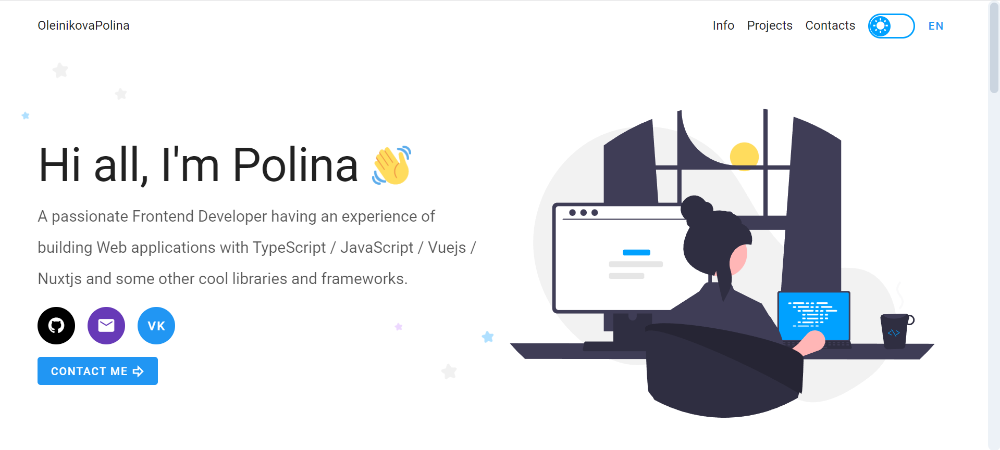

<div id="top"></div>

<!-- PROJECT LOGO -->
<br />
<div align="center">
  <h3 align="center">Portfolio</h3>
  <p align="center">
    👩‍💻💎 My portfolio built with Vue, Vuetify
    <br />
    <br />
    <a href="https://oleinikovapolina.github.io/portfolio/dist/#/">View Demo</a>
  </p>
</div>


<!-- TABLE OF CONTENTS -->
<details>
  <summary>Table of Contents</summary>
  <ol>
    <li><a href="#about">About the project</a></li>
    <li><a href="#features">Features</a></li>
    <li><a href="#built-with">Built With</a></li>
    <li><a href="#project-setup">Project setup</a></li>
  </ol>
</details>

<br/>

<!-- ABOUT -->
<h2 id="about">✨ About The Project</h2>



My portfolio

<p align="right">(<a href="#top">back to top</a>)</p>

<!-- FEATURES -->
<h2 id="features">🌟 FEATURES</h2>

* dark and light theme
* svg animation
* search projects by title, categories
* i18n
* custom scrollbar, cursor
* document.title come back

<p align="right">(<a href="#top">back to top</a>)</p>

<!-- BUILT WITH -->
<h2 id="built-with">🏗️ Built With</h2>

* Vue
* Typescript
* Vuex
* Vue-router
* Vuetify
* Axios
* Vue-i18n

<p align="right">(<a href="#top">back to top</a>)</p>

<!-- PROJECT SETUP -->
<h2 id="project-setup">⚙️ Project setup</h2>

```
npm install
```

### Compiles and hot-reloads for development

```
npm run serve
```

### Compiles and minifies for production

```
npm run build
```

### Lints and fixes files

```
npm run lint
```

### Customize configuration

See [Configuration Reference](https://cli.vuejs.org/config/).

<p align="right">(<a href="#top">back to top</a>)</p>
